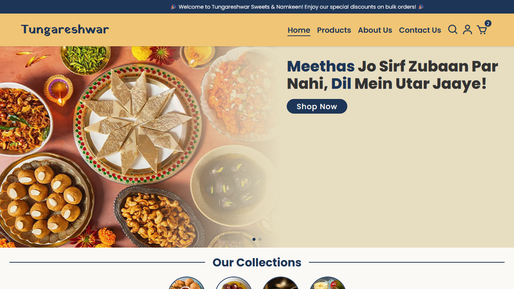
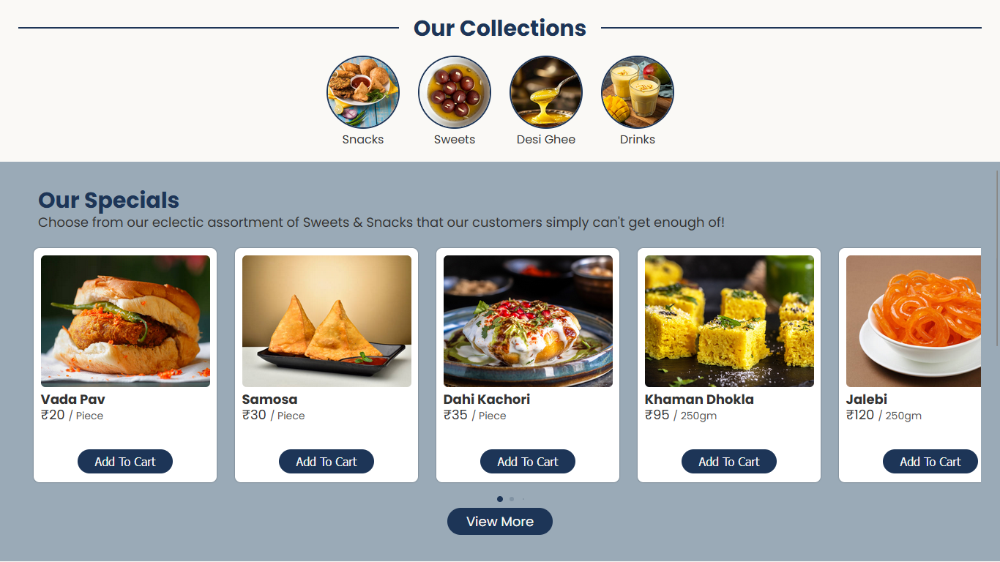
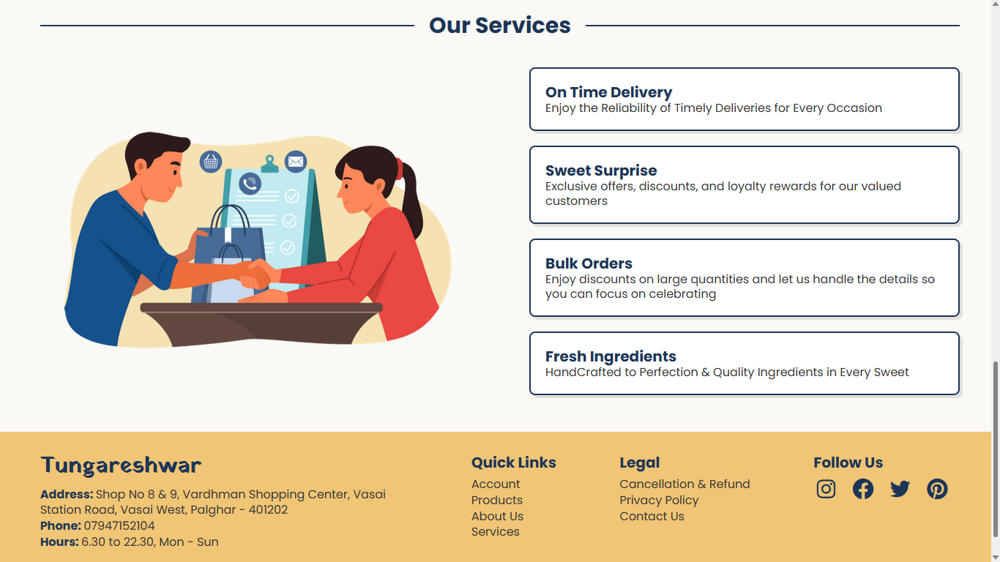
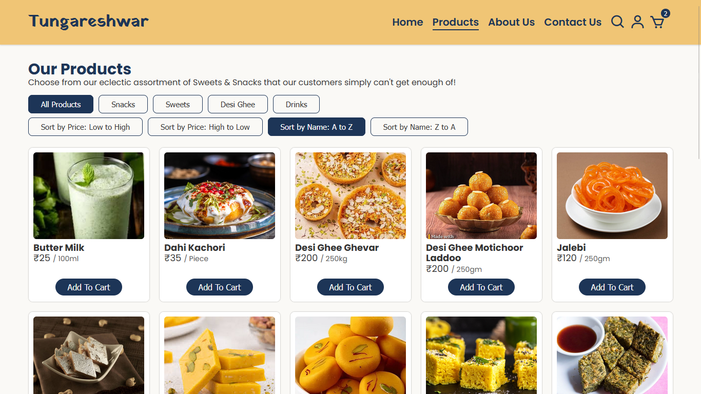
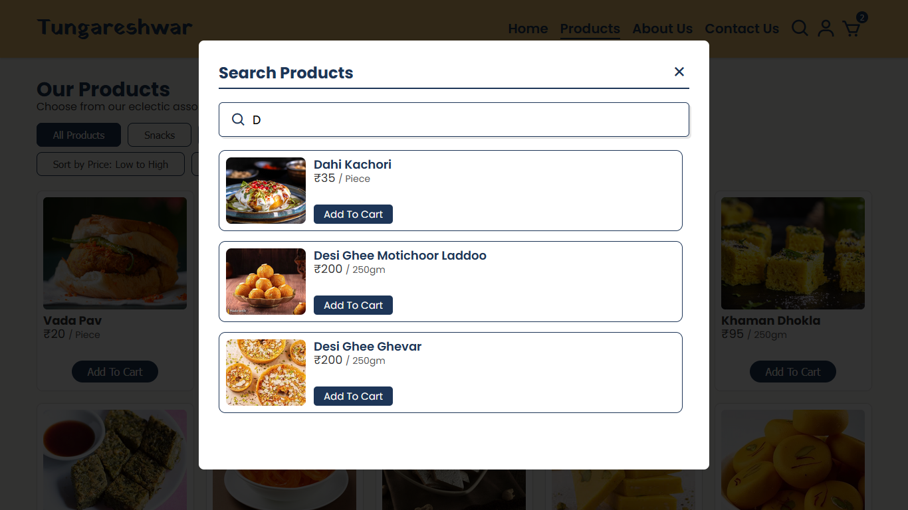
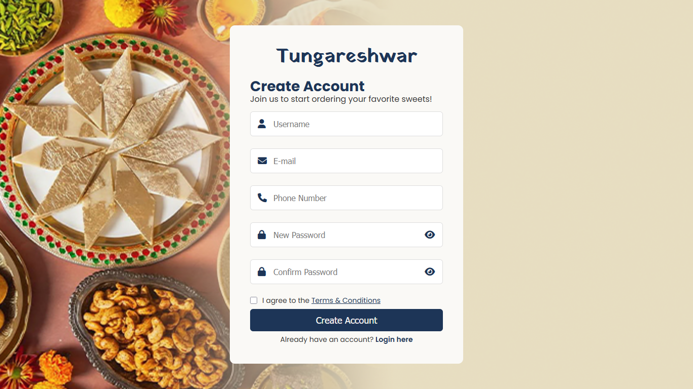
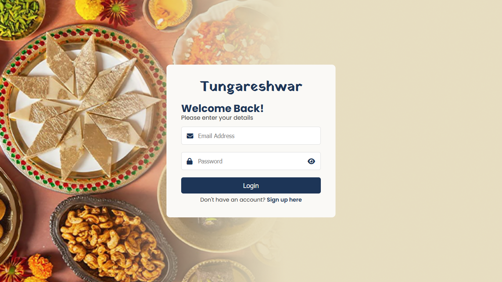
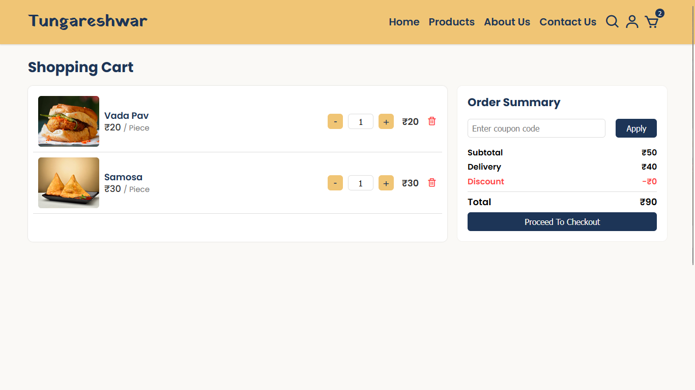
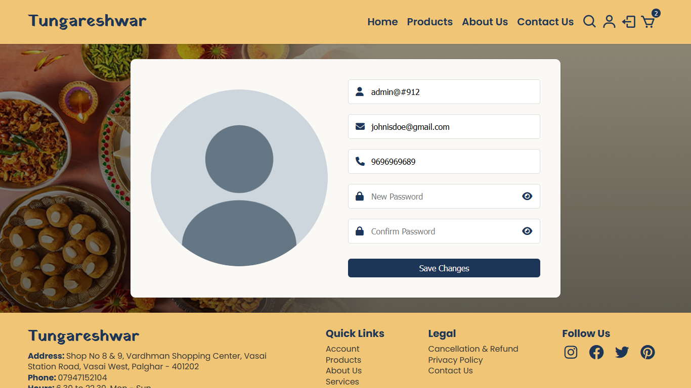

<h1 align="center">🍬 Tungareshwar - Sweets & Namkeen</h1>

This is the source code for **Tungareshwar**, a website developed for a local sweets shop as a part of my final year project in the Diploma in Computer Engineering program.

## 🌐 Project Overview

**Tungareshwar** is a responsive and visually appealing website designed to showcase a variety of traditional and modern sweets. The goal of this project was to build a user-friendly platform that promotes the shop's products, encourages customer engagement, and provides essential information like shop location, contact details, and an easy way to explore the shop’s offerings.

## 🛠️ Technologies Used

## 📸 Screenshots

  
  
  
  
  
  
  
  
  

## 📌 Features

- 🏠 **Homepage with Featured Items:** Visually rich homepage displaying popular or new sweets
- 🔍 **Search Functionality:** Quickly find specific sweets by name
- 🧂 **Product Filtering & Sorting:** Users can filter sweets by category, sort them by price, or view them alphabetically (A–Z / Z–A)
- 🛒 **Add to Cart:** Users can add sweets to a cart
- ✉️ **Contact Form:** Users can send messages or inquiries via a contact form
- 🔐 **User Authentication:** Includes login and registration pages with secure credential handling
- 📱 **Responsive Design:** Optimized for both mobile and desktop browsers
